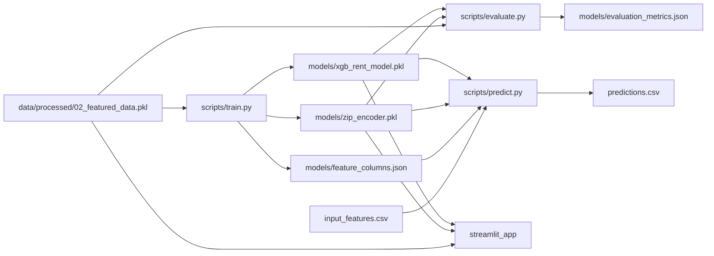

# RentPredictor

Swiss rental price prediction project with:
- an XGBoost model,
- reproducible train/evaluate/predict scripts,
- and a Streamlit app for interactive inference.

## Quick Start

```bash
conda env create -f environment.yml
conda activate swiss-rental
```

Train artifacts:

```bash
python scripts/train.py \
  --data data/processed/02_featured_data.pkl \
  --model-out models/xgb_rent_model.pkl \
  --encoder-out models/zip_encoder.pkl \
  --metrics-out models/training_metrics.json \
  --feature-columns-out models/feature_columns.json
```

Evaluate:

```bash
python scripts/evaluate.py \
  --data data/processed/02_featured_data.pkl \
  --model models/xgb_rent_model.pkl \
  --encoder models/zip_encoder.pkl \
  --metrics-out models/evaluation_metrics.json
```

Run app:

```bash
streamlit run app.py
```

## Architecture



## Canonical Notebook Flow

1. `notebooks/01_eda.ipynb`
2. `notebooks/02_features_and_baseline.ipynb`
3. `notebooks/03_ml_and_interpretability.ipynb`

## Project Structure

```text
RentPredictor/
  app.py
  scripts/
    train.py
    evaluate.py
    predict.py
  src/
    ml_pipeline.py
    mappings.py
  data/
    external/
    processed/
  models/
  notebooks/
  docs/
```

## Notes

- Batch prediction input must include raw preprocessing columns, including `Zip`, `Canton`, and `SubType`.
- Current workflow is prototype-focused; CI/tests are not yet added.
